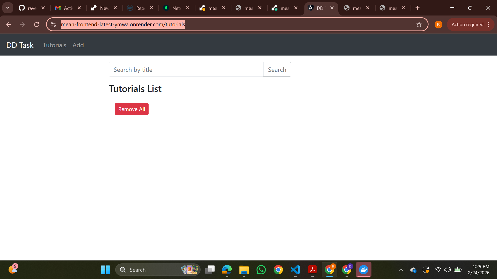

# MEAN Stack DevOps Assignment

## 📌 Project Overview

This project is a full-stack CRUD application developed using the **MEAN Stack**:

- MongoDB (Database)
- Express.js (Backend Framework)
- Angular 15 (Frontend Framework)
- Node.js (Runtime Environment)

The application manages a collection of tutorials. Each tutorial includes:

- ID
- Title
- Description
- Published Status (true/false)

Users can:

- Create tutorials
- Retrieve all tutorials
- Retrieve a single tutorial
- Update a tutorial
- Delete a tutorial
- Delete all tutorials
- Search tutorials by title

The project demonstrates full-stack development along with DevOps practices including Docker containerization and cloud deployment.

---

# 🏗 Application Architecture

Frontend (Angular 15)  
⬇ REST API Calls (HTTP)  
Backend (Node.js + Express)  
⬇  
MongoDB Atlas (Cloud Database)

Both frontend and backend are containerized using Docker and deployed on Render using DockerHub images.

---

# 🚀 Local Development Setup

---

## 🔹 Backend Setup (Node.js + Express)

### Step 1: Navigate to backend folder

```bash
cd backend
```

### Step 2: Install dependencies

```bash
npm install
```

### Step 3: Configure MongoDB Atlas

Update MongoDB connection string in:

```
backend/app/config/db.config.js
```

Example:

```js
module.exports = {
  url: "mongodb+srv://<username>:<password>@cluster0.mongodb.net/dd_db?retryWrites=true&w=majority"
};
```

⚠ Important:
If your password contains special characters like `@`, you must encode them.

Example:
```
Raveena@40123
```

Becomes:
```
Raveena%4040123
```

### Step 4: Run backend server

```bash
node server.js
```

Backend runs on:

```
http://localhost:8080
```

Test API:

```
http://localhost:8080/api/tutorials
```

---

## 🔹 Frontend Setup (Angular 15)

### Step 1: Navigate to frontend folder

```bash
cd frontend
```

### Step 2: Install dependencies

```bash
npm install
```

### Step 3: Configure API URL

Update the API base URL in:

```
frontend/src/app/services/tutorial.service.ts
```

Example:

```ts
const baseUrl = 'http://localhost:8080/api/tutorials';
```

### Step 4: Run Angular application

```bash
ng serve --port 8081
```

Open browser:

```
http://localhost:8081
```

---

# 🐳 Docker Configuration

Both frontend and backend are containerized using Docker.

---

## 🔹 Build Backend Docker Image

```bash
cd backend
docker build -t <your-dockerhub-username>/mean-backend:latest .
docker push <your-dockerhub-username>/mean-backend:latest
```

---

## 🔹 Build Frontend Docker Image

```bash
cd frontend
docker build -t <your-dockerhub-username>/mean-frontend:latest .
docker push <your-dockerhub-username>/mean-frontend:latest
```

---

# ☁ Cloud Deployment (Render)

The application is deployed using **Render Web Services**.

### Backend Deployment:
- Connected to DockerHub backend image
- Uses PORT 8080
- Connected to MongoDB Atlas database
- Automatically redeploys when new image is pushed

### Frontend Deployment:
- Connected to DockerHub frontend image
- Uses Nginx to serve Angular production build
- Communicates with deployed backend API

---

# 🌐 Live Application URLs

## 🔹 Backend API

Home:
```
https://mean-backend-latest-rul3.onrender.com
```

API:
```
https://mean-backend-latest-rul3.onrender.com/api/tutorials
```

---

## 🔹 Frontend Application

```
https://mean-frontend-latest-ymwa.onrender.com/tutorials
```

---

# 🛢 MongoDB Atlas Configuration

1. Created MongoDB Atlas cluster
2. Created database user with read/write access
3. Added IP Access:
   ```
   0.0.0.0/0
   ```
4. Used MongoDB connection string in backend configuration
5. Database name used: `dd_db`

---

# 📸 Application Screenshots

## Backend Output


## Frontend Output



---

# 📦 Technologies Used

- Node.js
- Express.js
- MongoDB Atlas
- Angular 15
- TypeScript
- Docker
- DockerHub
- Render Cloud Platform
- Nginx

---

# 🔧 DevOps Concepts Applied

- Docker containerization
- Docker image creation
- Image push to DockerHub
- Cloud deployment on Render
- MongoDB Atlas cloud database integration
- Service-based deployment
- Environment configuration
- Production build deployment

---

# 👩‍💻 Author

Raveena  
MEAN Stack DevOps Assignment  
Year: 2026
